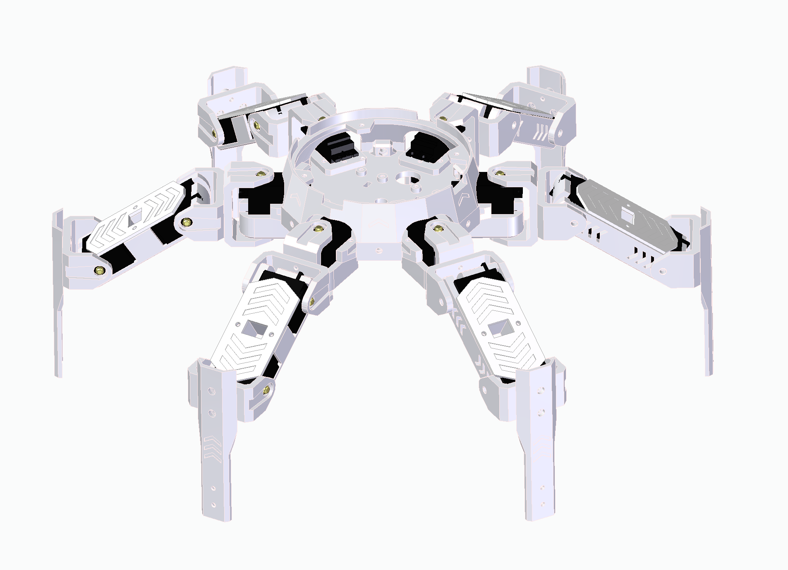
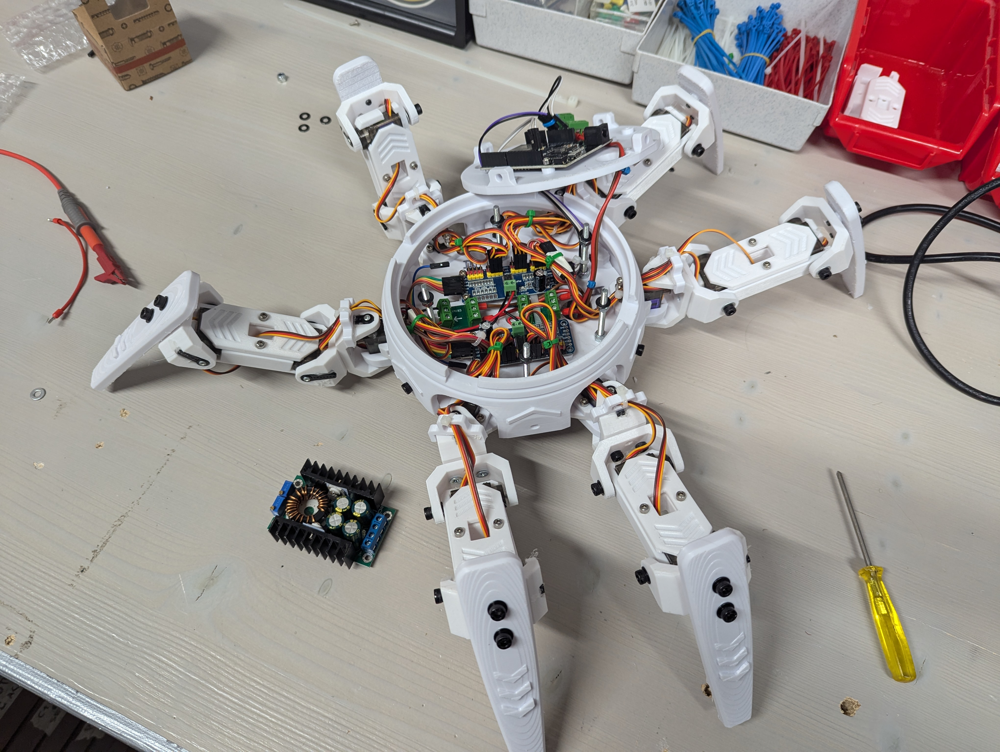

    

---

A robotic crab, designed as a hexapod to be taught and controlled by AI.

This repo contains purely the hardware (construction, electronics and related calculations). The operating system [CrabOS](https://github.com/ZVV2/CrabOS), the APIs [CrabAPIs](https://github.com/ZVV2/CrabAPI) and the AI/simulation [CrabRave](https://github.com/ZVV2/CrabRave) each have their own repos.

    
    

A full documentation is available [here](documentation/README.md). For further reading on the projects history and creation, read the [project log](documentation/project_log.md). To get an overview over recent changes see the [changelog](CHANGELOG.md).

The robot is designed and created by a [small team](https://github.com/ZVV2) as a fun little side project. We have no economic goals with it, feel free to use whatever you deem useful and let us know!