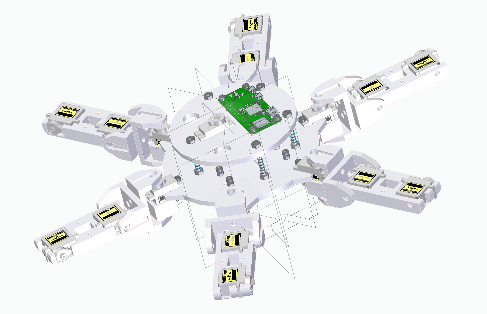
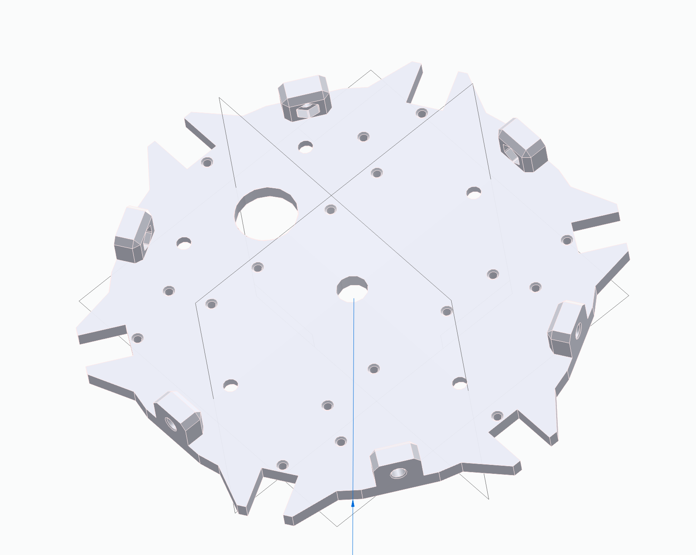
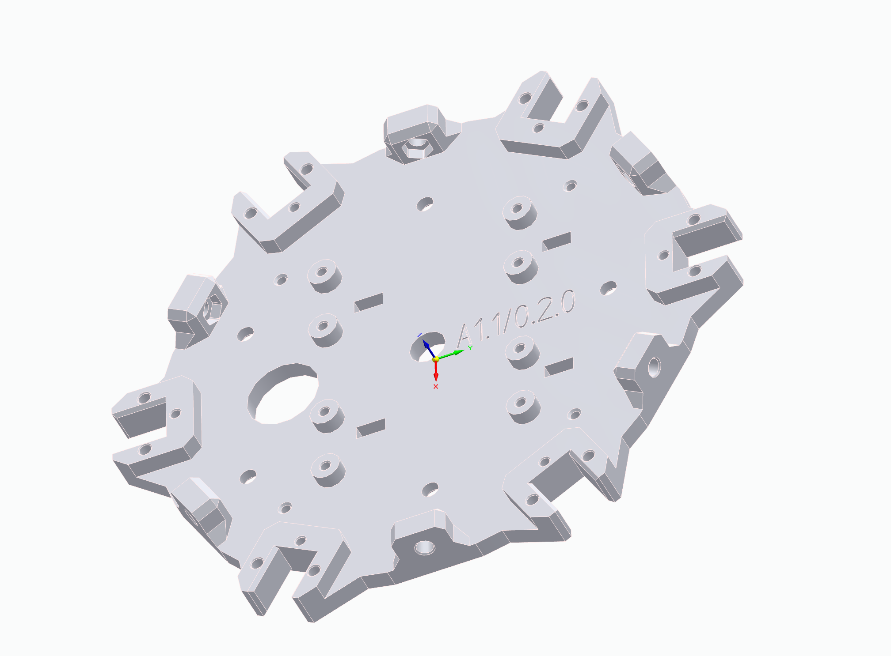
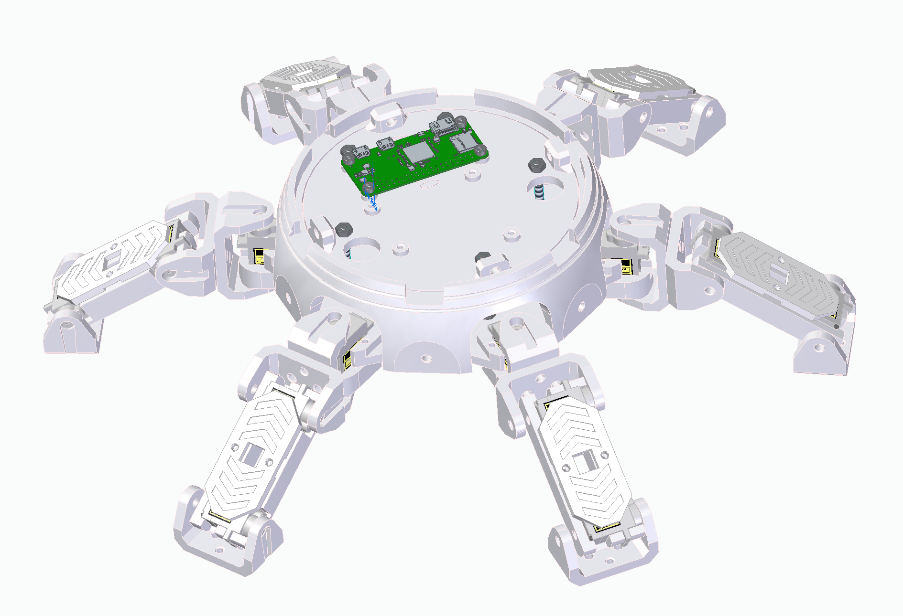
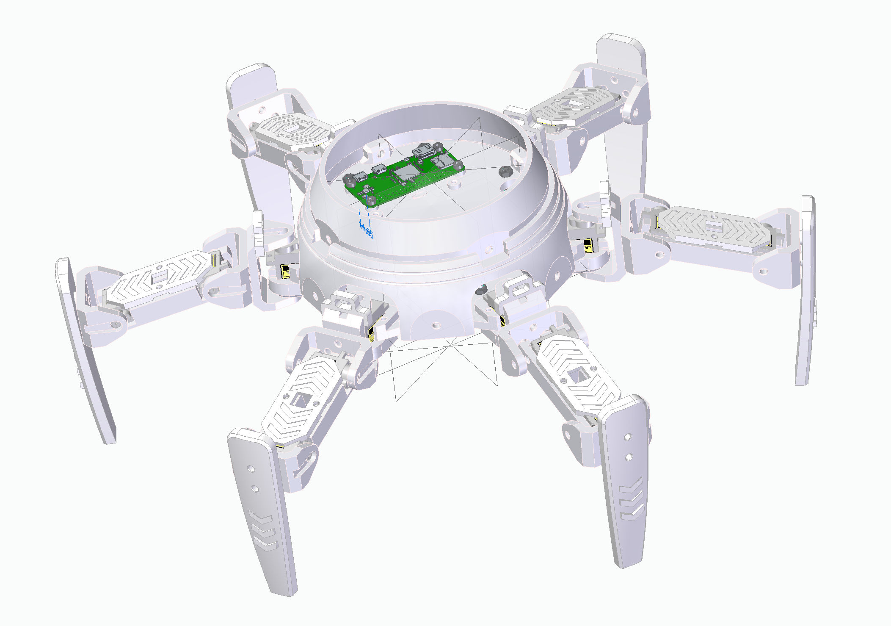

# Project Log

## Restarting project (2025/05/12)

The "Crabsy" project has been elevated from a small experiment of @SamuelNoesslboeck to a Team project to improve the quality of software and especially AI. As a first step, the repo has been moved an split up, with this repo containing only the construction and electronics from now on (everything concerning the hardware).

## Road towards first build (2025/05/26)

### Body and baseplate upgrades

For the new AI controlled version, a first build is currently in the making, with focus on basic controls for first tests. For that a new body was constructed, using a more enhanced baseplate, that correctly embeds all components.

    
    

### New design of leg segments

As it is common with hexapods, the last segments of the legs are rotated 90° downwards, resulting in the robot standing when all angles are set to their neutral position. Similar to crabs, the segments have been designed to resemble shells.

## Outcome of first build