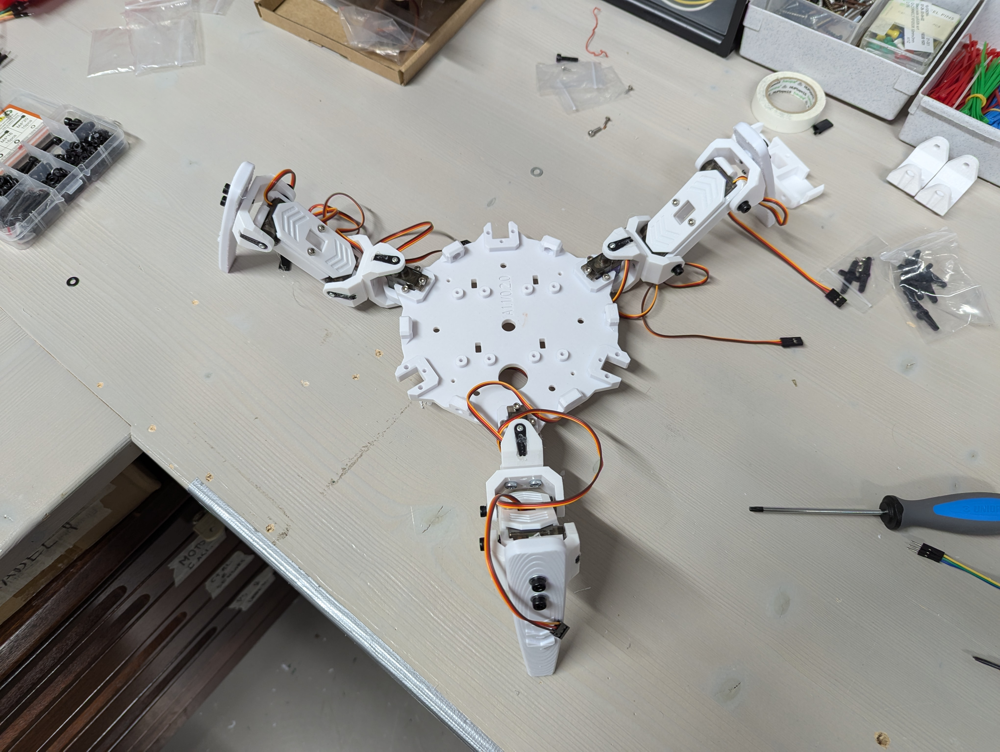
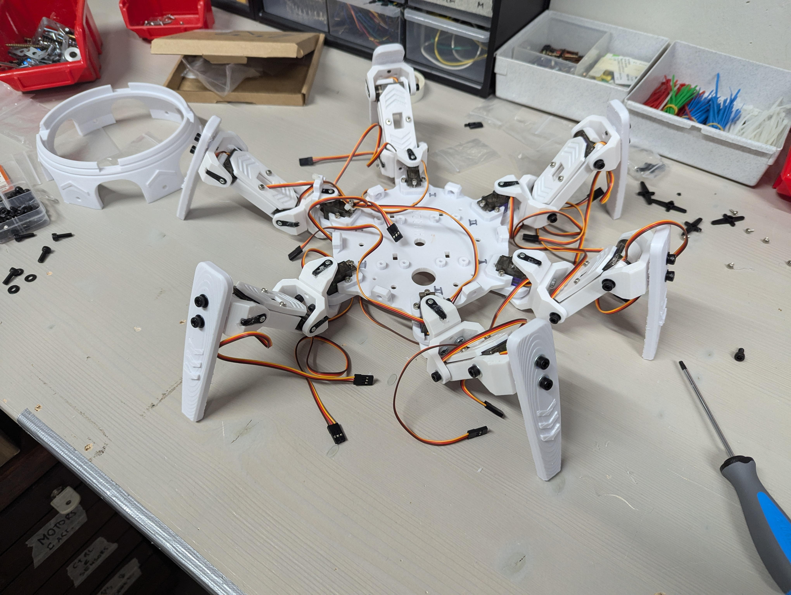
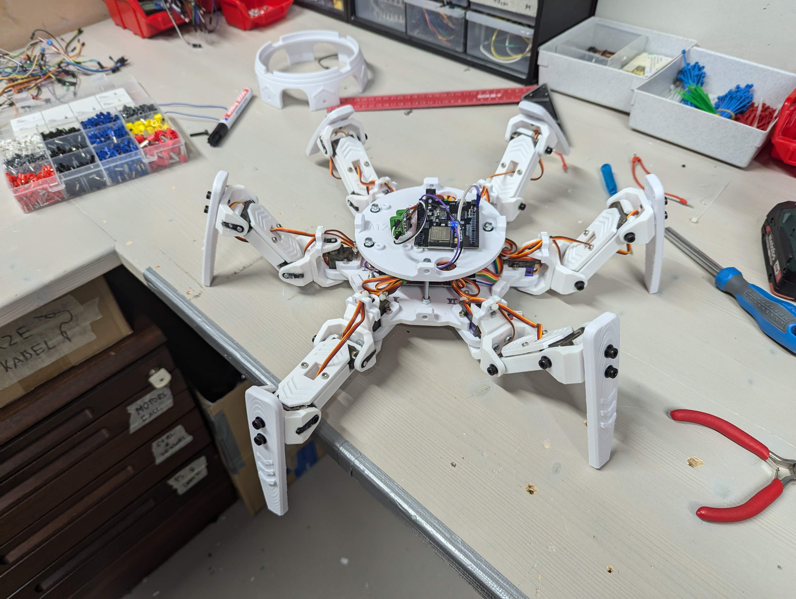

<h1>Project Log</h1>

- [Restarting project (2025/05/12)](#restarting-project-20250512)
- [Road towards first build (2025/05/26)](#road-towards-first-build-20250526)
  - [Body and baseplate upgrades](#body-and-baseplate-upgrades)
  - [New design of leg segments](#new-design-of-leg-segments)
- [Creating first build (2025/05/27)](#creating-first-build-20250527)
  - [Issues and solution ideas for next design](#issues-and-solution-ideas-for-next-design)
- [Second build (2025/06/18)](#second-build-20250618)
  - [First tests with second build (12/08/2025)](#first-tests-with-second-build-12082025)

## Restarting project (2025/05/12)

The "Crabsy" project has been elevated from a small experiment of @SamuelNoesslboeck to a Team project to improve the quality of software and especially AI. As a first step, the repo has been moved an split up, with this repo containing only the construction and electronics from now on (everything concerning the hardware).

## Road towards first build (2025/05/26)

### Body and baseplate upgrades

For the new AI controlled version, a first build is currently in the making, with focus on basic controls for first tests. For that a new body was constructed, using a more enhanced baseplate, that correctly embeds all components.

    
    

### New design of leg segments

As it is common with hexapods, the last segments of the legs are rotated 90° downwards, resulting in the robot standing when all angles are set to their neutral position. Similar to crabs, the segments have been designed to resemble shells.

## Creating first build (2025/05/27)

First all leg segments and the baseplate have been printed out and assembled accordingly. 

    
    

Afterwards, the baseplate has been equipped with it's electronic components, which are:

- The two PCA9685 16 channel servo controllers on top of the baseplate
- The battery module strapped to the bottom

Additionally, the next layer of the base has been attached to the passing screws, using 

- An ESP32 (NodeMCU32S) and
- A buck converter to 5V

as it's electronics. The finished build looked as follows:

    
    

The design of the lower hull part worked pretty well too by being attached to the bottom base layer with screws driving into nuts that have been slotted into fitting cut-outs as it is usual for 3D-printed parts.

### Issues and solution ideas for next design 

- The first major issue was the insufficient supply with power provided by the buck converters. Even with high-power buck converters the motors were unable to archive their promised load torque
- Even if less motors are used so they do reach the promised torque, they still prove to be much too weak for the desired strength of the robot
- The solution is to take medium servos instead of micro servos, as they are able to take 7.4V directly, so they do not require a buck converter in advance!

## Second build (2025/06/18)

In the second build, larger servo motors are used (medium sized ones). This requires quite a rework of the legs and their assembly to the baseplate. 

### First tests with second build (12/08/2025)

The second build proves to be a large success in most areas. The motors are supplied with more than enough power and can lift the weight of the robot with ease, some minor issues include:

- The servo horns should not be glued into the sockets anymore, a more permanent solution has to be found
  - There are metallic servo flanges available for purchase online, I ordered some of them and will adjust the build to the new horns soon